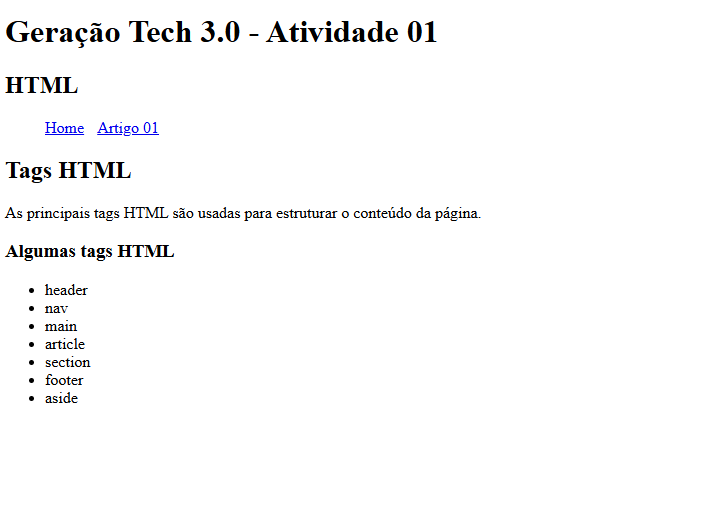

# Geração Tech 3.0 - Atividade 01



## Descrição

Este projeto é a primeira atividade do bootcamp **Geração Tech 3.0**, focado no aprendizado de **HTML** (HyperText Markup Language). 

O código apresenta uma página web estruturada utilizando as principais tags semânticas do HTML, demonstrando boas práticas de organização e estruturação de conteúdo web.

## O que é o Código?

Este arquivo `index.html` é uma página web que:

- **Estrutura semântica**: Utiliza tags HTML semânticas como `<header>`, `<nav>`, `<main>`, `<article>`, e `<section>` para organizar o conteúdo de forma clara e acessível.
- **Navegação**: Contém um menu de navegação com links para a página inicial e para um artigo.
- **Conteúdo**: Apresenta informações sobre as principais tags HTML e suas funcionalidades.
- **Responsividade**: Inclui meta tag de viewport para adaptação em diferentes dispositivos.

## Tecnologias Utilizadas

- **HTML5**: Linguagem de marcação para estruturação de conteúdo web
- **Idioma**: Português Brasileiro

## Autor

**Weber Fernandes da Silva**

## Projeto

**Geração Tech 3.0** - Bootcamp de desenvolvimento web focado em tecnologias front-end e back-end.

## Estrutura do Projeto

```
Atividade 01/
├── index.html
└── README.md
```

## Como Usar

1. Clone o repositório:
```bash
git clone https://github.com/weberfern/gtech-2025.git
```

2. Navegue até o diretório da atividade:
```bash
cd "Atividades/HTML/Atividade 01"
```

3. Abra o arquivo `index.html` em seu navegador preferido.

## Licença

Este projeto é parte do bootcamp Geração Tech 3.0 e é fornecido apenas para fins educacionais.
