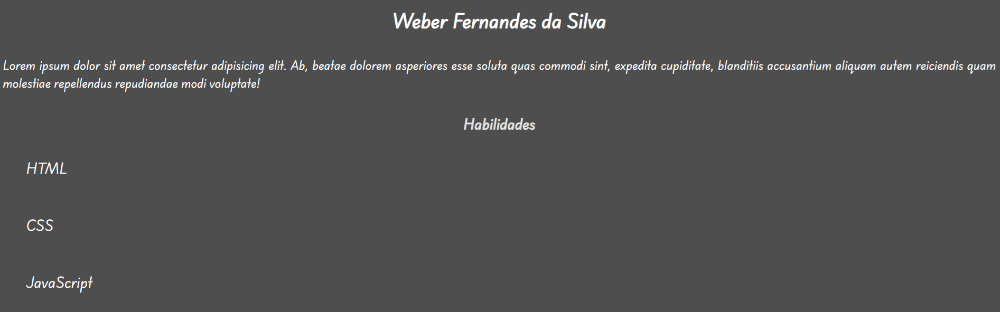

# Geração Tech 3.0 - Atividade Prática



## Descrição

Este projeto é uma atividade prática do bootcamp **Geração Tech 3.0**, focado no aprendizado de **HTML** e **CSS externo** com integração de **Google Fonts**. 

O código apresenta uma página de perfil pessoal simples com estilização organizada em arquivo CSS separado, demonstrando boas práticas de separação de conteúdo e estilo.

## O que é o Código?

Este projeto contém uma página web com os seguintes arquivos:

- **index.html**: Página de perfil com nome, descrição e lista de habilidades
- **styles.css**: Arquivo CSS externo com toda a estilização da página

### Características:

- **Estrutura semântica**: Utiliza tags HTML semânticas como `<section>` e elementos de lista
- **CSS externo**: Separação completa de estilos em arquivo dedicado
- **Google Fonts**: Fonte personalizada "Playwrite NZ Basic" importada do Google Fonts
- **CSS inline e interno**: Demonstra uso combinado de CSS externo, interno (`<style>`) e inline
- **Flexbox**: Uso de `display: flex` para organização da lista de habilidades
- **Responsividade**: Meta tag de viewport para adaptação em diferentes dispositivos

## Tecnologias Utilizadas

- **HTML5**: Linguagem de marcação para estruturação de conteúdo web
- **CSS3**: Arquivo de estilos externo para estilização
- **Google Fonts**: Fonte Playwrite NZ Basic
- **Idioma**: Português Brasileiro

## Autor

**Weber Fernandes da Silva**

## Projeto

**Geração Tech 3.0** - Bootcamp de desenvolvimento web focado em tecnologias front-end e back-end.

## Estrutura do Projeto

```
Atividade Pratica/
├── index.html
├── styles.css
└── README.md
```

## Como Usar

1. Clone o repositório:
```bash
git clone https://github.com/weberfern/G-tech-2025-2026-HTML.git
```

2. Navegue até o diretório da atividade:
```bash
cd "HTML/Atividade Pratica"
```

3. Abra o arquivo `index.html` em seu navegador de preferência.

## Características do CSS

- **Cores personalizadas**: Fundo cinza escuro (#4e4e4e) com textos em branco
- **Tipografia**: Google Font "Playwrite NZ Basic" aplicada globalmente
- **Layout flexível**: Lista de habilidades organizada com Flexbox
- **Classes utilitárias**: `.h1`, `.h2`, `.h3` para estilização diferenciada dos itens

## Licença

Este projeto é parte do bootcamp Geração Tech 3.0 e é fornecido apenas para fins educacionais.
